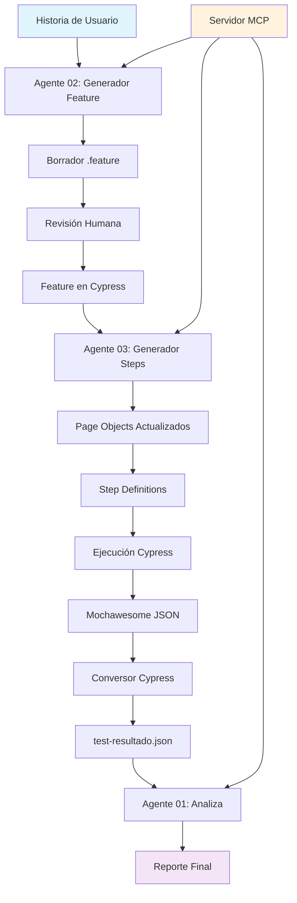
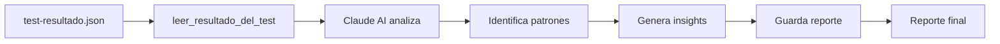

# QA Agente V2

Proyecto para aprender sobre agentes de IA y automatización de pruebas de calidad con MCP (Model Context Protocol).

## Descripción

Este proyecto implementa un ecosistema completo de agentes de IA para automatizar el proceso de QA, utilizando el protocolo MCP para la comunicación entre componentes. El sistema incluye:

- **Servidor MCP**: Proporciona herramientas centralizadas para gestión de reportes y archivos
- **Agente 01 - Lee y Analiza**: Analiza resultados de pruebas automatizadas y genera reportes
- **Agente 02 - Generador**: Convierte Historias de Usuario a escenarios Gherkin para Cypress o Playwright
- **Conversor de Cypress**: Transforma resultados de Mochawesome al formato del sistema

## Estructura del Proyecto

```
qa-agente-v2/
├── README.md               # Este archivo de documentación
├── .env                    # Variables de entorno (ANTHROPIC_API_KEY)
├── .gitignore             # Archivos ignorados por Git
├── package.json           # Dependencias y scripts del proyecto
├── tsconfig.json          # Configuración de TypeScript
├── convertir-cypress.mjs  # Conversor de resultados Mochawesome → formato Agente01
├── mcp-server/            # Servidor MCP principal
│   └── index.ts          # Código del servidor con herramientas registradas
├── agentes/               # Directorio de agentes de IA
│   ├── agente01-LeeAnaliza/
│   │   └── index.ts      # Agente que analiza resultados de pruebas
│   ├── agente02-GeneradorFeature/
│   │   └── index.ts      # Agente que genera .feature desde Historias de Usuario
│   └── agente03-GeneradorSteps/
│       └── index.ts      # Agente que genera step definitions y Page Objects
├── historias/             # Historias de Usuario para procesar
│   ├── historia_usuario.txt # Ejemplo de historia de usuario
│   └── hu-sprint3.txt      # Historia de usuario Sprint 3 (Carrito de compras)
├── results/               # Carpeta para almacenar reportes y borradores
│   ├── test-resultado.json # Resultados de pruebas convertidos
│   └── historia_usuario-borrador.txt # Borradores generados
└── node_modules/          # Dependencias instaladas
```

## Funcionalidades Implementadas

### Servidor MCP

El servidor (`mcp-server/index.ts`) proporciona herramientas centralizadas para la gestión de reportes y archivos:

#### 1. `listar_reportes`
- **Descripción**: Lista todos los reportes guardados en la carpeta `results`
- **Parámetros**: No requiere parámetros
- **Uso**: Ideal para obtener un overview de todos los reportes disponibles

#### 2. `leer_resultado_del_test`
- **Descripción**: Lee el contenido de un archivo JSON de resultados de pruebas
- **Parámetros**: 
  - `fileName` (string): Nombre del archivo JSON a leer
- **Uso**: Permite examinar el contenido detallado de un reporte específico

#### 3. `guardar_reporte`
- **Descripción**: Guarda un reporte en la carpeta `results`
- **Parámetros**:
  - `fileName` (string): Nombre del archivo JSON a guardar
  - `content` (string): Contenido del reporte a guardar
- **Uso**: Almacena nuevos resultados de pruebas para análisis posterior

#### 4. `leer_historia_usuario`
- **Descripción**: Lee el contenido de un archivo .txt que contiene una Historia de Usuario
- **Parámetros**:
  - `fileName` (string): Nombre del archivo .txt a leer
- **Uso**: Permite a los agentes acceder a las historias de usuario para procesar

#### 5. `guardar_borrador_gherkin`
- **Descripción**: Guarda el Gherkin generado como borrador en /results para revisión
- **Parámetros**:
  - `content` (string): Contenido del Gherkin generado
  - `fileName` (string): Nombre del archivo borrador
- **Uso**: Almacena borradores de escenarios Gherkin antes de aprobación

#### 6. `guardar_feature_en_cypress`
- **Descripción**: Copia el borrador aprobado al proyecto Cypress como archivo .feature
- **Parámetros**:
  - `borradorFileName` (string): Nombre del archivo borrador en /results
  - `featureFileName` (string): Nombre del .feature destino
  - `sprint` (string): Carpeta del sprint destino
- **Uso**: Mueve escenarios aprobados al proyecto de pruebas

#### 7. `ejecutar_cypress`
- **Descripción**: Ejecuta las pruebas de Cypress y convierte el resultado al formato del agente
- **Parámetros**:
  - `spec` (string): Ruta del archivo .feature a ejecutar
- **Uso**: Corre pruebas automatizadas y genera reportes

### Agentes de IA

#### Agente 01 - Lee y Analiza (`agentes/agente01-LeeAnaliza/index.ts`)
- **Propósito**: Analizar resultados de pruebas automatizadas y generar reportes detallados
- **Funcionalidad**:
  - Consume resultados de pruebas desde `results/test-resultado.json`
  - Utiliza Claude AI para analizar patrones, identificar problemas y generar insights
  - Genera reportes estructurados con estadísticas y recomendaciones
- **Ejecución**: `npm run agente01`

#### Agente 02 - Generador de Features (`agentes/agente02-GeneradorFeature/index.ts`)
- **Propósito**: Convertir Historias de Usuario a archivos .feature para Cypress
- **Funcionalidad**:
  - Lee Historias de Usuario desde la carpeta `historias/`
  - Genera escenarios Gherkin en español siguiendo mejores prácticas
  - Operación en dos modos: borrador y confirmación
- **Ejecución**:
  - Generar borrador: `npm run agente02:borrador historia_usuario.txt`
  - Confirmar y mover: `npm run agente02:confirmar login-borrador.txt Sprint1 login.feature`

#### Agente 03 - Generador de Steps (`agentes/agente03-GeneradorSteps/index.ts`)
- **Propósito**: Generar step definitions y actualizar Page Objects automáticamente
- **Funcionalidad**:
  - Lee archivos .feature existentes en el proyecto Cypress
  - Analiza Page Objects (Elementos y Funciones) existentes
  - Genera step definitions en TypeScript
  - Actualiza Page Objects con nuevos selectores y métodos faltantes
- **Ejecución**: `npm run agente03 -- Sprint1/login.feature Login Sprint1/login.ts`

### Conversor de Cypress (`convertir-cypress.mjs`)

- **Propósito**: Transformar resultados de Mochawesome al formato que entiende el Agente01
- **Funcionalidad**:
  - Lee archivos JSON generados por Mochawesome en proyectos Cypress
  - Extrae información relevante de tests (nombre, estado, duración, errores)
  - Convierte al formato estandarizado utilizado por el sistema
- **Ejecución**: `node convertir-cypress.mjs`

## Configuración

El proyecto utiliza variables de entorno definidas en el archivo `.env` para configuración sensible:

```env
ANTHROPIC_API_KEY=tu_api_key_aqui
```

**Importante**: Debes agregar tu `ANTHROPIC_API_KEY` para que los agentes puedan comunicarse con Claude AI.

## Instalación y Ejecución

### Prerrequisitos
- Node.js (versión 18 o superior)
- npm o yarn
- API Key de Anthropic Claude

### Instalación de Dependencias
```bash
npm install
```

### Flujo de Trabajo Típico

#### 1. Iniciar el Servidor MCP
```bash
npm run server
```

#### 2. Generar Escenarios Gherkin desde Historia de Usuario
```bash
# Generar borrador
npm run agente02:borrador historia_usuario.txt

# Revisar el borrador en results/historia_usuario-borrador.txt
# Si está correcto, confirmar y mover al proyecto Cypress
npm run agente02:confirmar historia_usuario-borrador.txt Sprint1 login.feature
```

#### 3. Convertir Resultados de Cypress (si tienes tests existentes)
```bash
node convertir-cypress.mjs
```

#### 4. Analizar Resultados de Pruebas
```bash
npm run agente01
```

### Scripts Disponibles

- `npm run server` - Inicia el servidor MCP
- `npm run agente01` - Ejecuta el agente analista de resultados
- `npm run agente02:borrador [archivo]` - Genera borrador .feature desde Historia de Usuario
- `npm run agente02:confirmar [borrador] [sprint] [feature]` - Confirma y mueve archivo .feature
- `npm run agente03 -- [feature] [pageObject] [output]` - Genera step definitions desde .feature

## Ejemplos Detallados de Uso

### 🚀 Ejemplo 1: Flujo Completo - Historia de Usuario → Pruebas Funcionales

**Paso 1: Crear/Actualizar una Historia de Usuario**
```bash
# Editar el archivo de historia
# historias/hu-sprint3.txt
```

**Paso 2: Generar Feature File desde la Historia**
```bash
# Generar borrador del feature
npm run agente02:borrador hu-sprint3.txt

# El agente creará: results/hu-sprint3-borrador.txt
```

**Paso 3: Revisar y Confirmar el Feature**
```bash
# Revisar el borrador generado
cat results/hu-sprint3-borrador.txt

# Si está correcto, confirmar y mover al proyecto Cypress
npm run agente02:confirmar hu-sprint3-borrador.txt Sprint3 carrito-compras.feature
```

**Paso 4: Generar Step Definitions y Page Objects**
```bash
# Generar steps y actualizar Page Objects automáticamente
npm run agente03 -- Sprint3/carrito-compras.feature Carrito Sprint3/carrito-compras.ts
```

**Paso 5: Ejecutar las Pruebas**
```bash
# (En el proyecto Cypress) Ejecutar el nuevo feature
npx cypress run --spec "cypress/e2e/features/Sprint3/carrito-compras.feature"
```

**Paso 6: Analizar Resultados**
```bash
# Convertir resultados de Mochawesome
node convertir-cypress.mjs

# Analizar con el Agente 01
npm run agente01
```

### 🔍 Ejemplo 2: Análisis de Resultados de Pruebas Existentes

**Paso 1: Convertir Resultados de Cypress**
```bash
# Asegúrate que el archivo exista: D:/QA/Front/cypress_front/cypress/results/mochawesome.json
node convertir-cypress.mjs

# Output: ✅ Conversión exitosa!
#    Tests encontrados: 15
#    Pasaron: 12
#    Fallaron: 3
#    Guardado en: ./results/test-resultado.json
```

**Paso 2: Analizar con IA**
```bash
npm run agente01

# El agente:
# 1. Lee results/test-resultado.json
# 2. Analiza patrones de fallas
# 3. Identifica tests flaky
# 4. Genera recomendaciones
# 5. Crea un reporte detallado
```

### 🎯 Ejemplo 3: Actualizar Page Objects Automáticamente

**Escenario**: Tienes un .feature existente pero necesitas actualizar los Page Objects

```bash
# El agente 3 analizará:
# 1. El archivo .feature para identificar todos los steps
# 2. Los Page Objects existentes (Elementos.js y Funciones.js)
# 3. Detectará qué selectores y métodos faltan
# 4. Actualizará automáticamente los Page Objects
# 5. Generará el step definition completo

npm run agente03 -- Sprint1/login.feature Login Sprint1/login.ts

# Output esperado:
# 📂 Feature:     Sprint1/login.feature
# 📂 Page Object: Login/LoginElementos.js
# 📂 Page Object: Login/LoginFunciones.js
# 📂 Output:      Sprint1/login.ts

# ✅ Selectores agregados a Login/LoginElementos.js: btnLogin, inputPassword
# ✅ Métodos agregados a Login/LoginFunciones.js: ingresarCredenciales, clickLogin
# ✅ Steps guardados en: D:/QA/Front/cypress_front/cypress/e2e/stepDefinitions/Sprint1/login.ts
```

### 📝 Ejemplo 4: Procesar Múltiples Historias de Usuario

```bash
# Procesar múltiples historias en secuencia
for historia in historias/*.txt; do
  nombre=$(basename "$historia" .txt)
  
  echo "Procesando: $nombre"
  
  # Generar borrador
  npm run agente02:borrador "$nombre.txt"
  
  # Confirmar automáticamente (si confías en la calidad)
  npm run agente02:confirmar "$nombre-borrador.txt" "Sprint$(date +%Y%m%d)" "$nombre.feature"
  
  # Generar steps
  npm run agente03 -- "Sprint$(date +%Y%m%d)/$nombre.feature" "$(echo $nombre | cut -d'-' -f1)" "Sprint$(date +%Y%m%d)/$nombre.ts"
done
```

### 🛠️ Ejemplo 5: Debug y Troubleshooting

**Verificar que todo esté configurado correctamente:**
```bash
# 1. Verificar variables de entorno
cat .env

# 2. Verificar que el servidor MCP funcione
npm run server

# 3. Probar con una historia simple
echo "Historia simple de prueba" > historias/test.txt
npm run agente02:borrador test.txt
```

**Si algo falla, verificar:**
```bash
# Estructura de archivos
tree agentes/ historias/ results/

# Permisos en el proyecto Cypress
ls -la "D:/QA/Front/cypress_front/cypress/e2e/"

# Logs de errores
npm run agente01 2>&1 | tee debug.log
```

## Diagrama de Flujo del Sistema



## Flujo de Trabajo por Agente

### 📝 Agente 02: Generador de Features
**Input**: Historia de Usuario (`.txt`) → **Output**: Feature File (`.feature`)


### 🔧 Agente 03: Generador de Steps
**Input**: Feature File (`.feature`) → **Output**: Step Definitions (`.ts`) + Page Objects


### 📊 Agente 01: Analizador de Resultados
**Input**: Test Results (`.json`) → **Output**: Reporte Analítico



## Formatos de Archivos

### Historia de Usuario (`historias/hu-sprint3.txt`)
Ejemplo del formato estructurado para el Sprint 3:

```txt
HISTORIA DE USUARIO — Sprint 3
Funcionalidad: Gestión del Carrito de Compras
Aplicación: SauceDemo (https://www.saucedemo.com)
Credenciales: usuario: standard_user / password: secret_sauce

─────────────────────────────────────────────────
COMO usuario autenticado en SauceDemo
QUIERO poder agregar y quitar productos del carrito
PARA gestionar mis compras antes de finalizar el pedido
─────────────────────────────────────────────────

CRITERIOS DE ACEPTACIÓN:

1. AGREGAR PRODUCTO AL CARRITO
   - Dado que el usuario está en la página de productos
   - Cuando hace clic en "Add to cart" de un producto
   - Entonces el ícono del carrito muestra 1 producto

2. AGREGAR MÚLTIPLES PRODUCTOS
   - Dado que el usuario está en la página de productos
   - Cuando agrega 2 productos distintos al carrito
   - Entonces el ícono del carrito muestra 2 productos
```

### Resultados de Pruebas (`results/test-resultado.json`)
```json
{
  "total": 10,
  "passed": 8,
  "failed": 2,
  "duration": 5432,
  "tests": [
    {
      "name": "Login exitoso redirige al inventario",
      "status": "passed",
      "duration": 1234,
      "error": null
    }
  ]
}
```

### Borradores Gherkin (`results/*-borrador.txt`)
Formato Gherkin estándar en español:
```gherkin
Feature: Inicio de sesión de usuario

  @login_exitoso
  Scenario: Login exitoso con credenciales válidas
    Given que soy un usuario registrado
    When ingreso mis credenciales válidas
    Then debería ser redirigido al inventario de productos
    And debería ver mi nombre de usuario en la interfaz
```

## Herramientas MCP Disponibles

### Para Agente 02 (Generador de Features)
- **leer_historia_usuario**: Lee archivos .txt de historias de usuario
- **guardar_borrador_gherkin**: Guarda borradores en `/results` para revisión
- **guardar_feature_en_cypress**: Mueve features aprobados al proyecto Cypress

### Para Agente 03 (Generador de Steps)
- **leer_feature**: Lee archivos .feature del proyecto Cypress
- **leer_page_object**: Lee Page Objects (Elementos.js y Funciones.js)
- **actualizar_page_object_elementos**: Agrega nuevos selectores XPath
- **actualizar_page_object_funciones**: Agrega nuevos métodos a Page Objects
- **guardar_steps**: Guarda step definitions en TypeScript

### Para Agente 01 (Analizador)
- **listar_reportes**: Lista todos los reportes en `/results`
- **leer_resultado_del_test**: Lee resultados de pruebas en formato JSON
- **guardar_reporte**: Guarda reportes analizados

## Comandos Rápidos de Referencia

```bash
# 🚀 Flujo completo (desde cero)
npm run agente02:borrador hu-sprint3.txt && \
npm run agente02:confirmar hu-sprint3-borrador.txt Sprint3 carrito-compras.feature && \
npm run agente03 -- Sprint3/carrito-compras.feature Carrito Sprint3/carrito-compras.ts

# 📊 Análisis de resultados
node convertir-cypress.mjs && npm run agente01

# 🔄 Procesamiento batch
for f in historias/*.txt; do npm run agente02:borrador $(basename $f); done

# 🛠️ Debug
npm run server  # Terminal 1
npm run agente02:borrador historia_usuario.txt  # Terminal 2
```

## Dependencias Principales

- `@modelcontextprotocol/sdk`: SDK para implementar servidores MCP
- `@anthropic-ai/sdk`: SDK de Anthropic para integración con modelos de IA
- `dotenv`: Manejo de variables de entorno
- `zod`: Validación de esquemas de datos
- `typescript`: Compilador de TypeScript
- `ts-node`: Ejecución directa de archivos TypeScript

---

**✨ README actualizado con todos los agentes y ejemplos detallados de uso!**
