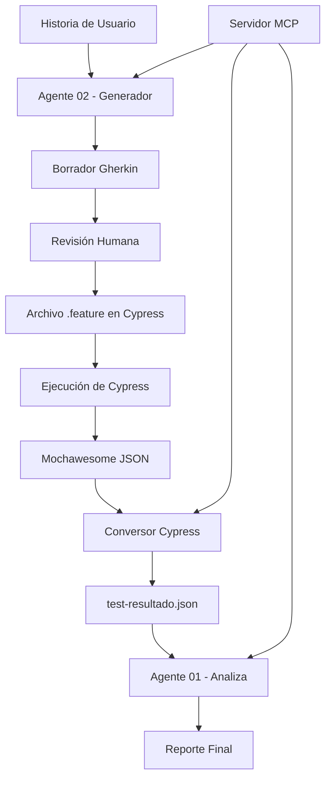

# QA Agente V2

Proyecto para aprender sobre agentes de IA y automatización de pruebas de calidad con MCP (Model Context Protocol).

## Descripción

Este proyecto implementa un ecosistema completo de agentes de IA para automatizar el proceso de QA, utilizando el protocolo MCP para la comunicación entre componentes. El sistema incluye:

- **Servidor MCP**: Proporciona herramientas centralizadas para gestión de reportes y archivos
- **Agente 01 - Lee y Analiza**: Analiza resultados de pruebas automatizadas y genera reportes
- **Agente 02 - Generador**: Convierte Historias de Usuario a escenarios Gherkin para Cypress o Playwright
- **Conversor de Cypress**: Transforma resultados de Mochawesome al formato del sistema

## Estructura del Proyecto

```
qa-agente-v2/
├── README.md               # Este archivo de documentación
├── .env                    # Variables de entorno (ANTHROPIC_API_KEY)
├── .gitignore             # Archivos ignorados por Git
├── package.json           # Dependencias y scripts del proyecto
├── tsconfig.json          # Configuración de TypeScript
├── convertir-cypress.mjs  # Conversor de resultados Mochawesome → formato Agente01
├── mcp-server/            # Servidor MCP principal
│   └── index.ts          # Código del servidor con herramientas registradas
├── agentes/               # Directorio de agentes de IA
│   ├── agente01-LeeAnaliza/
│   │   └── index.ts      # Agente que analiza resultados de pruebas
│   └── agente02-Generador/
│       └── index.ts      # Agente que genera Gherkin desde Historias de Usuario
├── historias/             # Historias de Usuario para procesar
│   └── historia_usuario.txt # Ejemplo de historia de usuario
├── results/               # Carpeta para almacenar reportes y borradores
│   ├── test-resultado.json # Resultados de pruebas convertidos
│   └── historia_usuario-borrador.txt # Borradores generados
└── node_modules/          # Dependencias instaladas
```

## Funcionalidades Implementadas

### Servidor MCP

El servidor (`mcp-server/index.ts`) proporciona herramientas centralizadas para la gestión de reportes y archivos:

#### 1. `listar_reportes`
- **Descripción**: Lista todos los reportes guardados en la carpeta `results`
- **Parámetros**: No requiere parámetros
- **Uso**: Ideal para obtener un overview de todos los reportes disponibles

#### 2. `leer_resultado_del_test`
- **Descripción**: Lee el contenido de un archivo JSON de resultados de pruebas
- **Parámetros**: 
  - `fileName` (string): Nombre del archivo JSON a leer
- **Uso**: Permite examinar el contenido detallado de un reporte específico

#### 3. `guardar_reporte`
- **Descripción**: Guarda un reporte en la carpeta `results`
- **Parámetros**:
  - `fileName` (string): Nombre del archivo JSON a guardar
  - `content` (string): Contenido del reporte a guardar
- **Uso**: Almacena nuevos resultados de pruebas para análisis posterior

#### 4. `leer_historia_usuario`
- **Descripción**: Lee el contenido de un archivo .txt que contiene una Historia de Usuario
- **Parámetros**:
  - `fileName` (string): Nombre del archivo .txt a leer
- **Uso**: Permite a los agentes acceder a las historias de usuario para procesar

#### 5. `guardar_borrador_gherkin`
- **Descripción**: Guarda el Gherkin generado como borrador en /results para revisión
- **Parámetros**:
  - `content` (string): Contenido del Gherkin generado
  - `fileName` (string): Nombre del archivo borrador
- **Uso**: Almacena borradores de escenarios Gherkin antes de aprobación

#### 6. `guardar_feature_en_cypress`
- **Descripción**: Copia el borrador aprobado al proyecto Cypress como archivo .feature
- **Parámetros**:
  - `borradorFileName` (string): Nombre del archivo borrador en /results
  - `featureFileName` (string): Nombre del .feature destino
  - `sprint` (string): Carpeta del sprint destino
- **Uso**: Mueve escenarios aprobados al proyecto de pruebas

#### 7. `ejecutar_cypress`
- **Descripción**: Ejecuta las pruebas de Cypress y convierte el resultado al formato del agente
- **Parámetros**:
  - `spec` (string): Ruta del archivo .feature a ejecutar
- **Uso**: Corre pruebas automatizadas y genera reportes

### Agentes de IA

#### Agente 01 - Lee y Analiza (`agentes/agente01-LeeAnaliza/index.ts`)
- **Propósito**: Analizar resultados de pruebas automatizadas y generar reportes detallados
- **Funcionalidad**:
  - Consume resultados de pruebas desde `results/test-resultado.json`
  - Utiliza Claude AI para analizar patrones, identificar problemas y generar insights
  - Genera reportes estructurados con estadísticas y recomendaciones
- **Ejecución**: `npm run agente01`

#### Agente 02 - Generador (`agentes/agente02-Generador/index.ts`)
- **Propósito**: Convertir Historias de Usuario a escenarios Gherkin para Cypress
- **Funcionalidad**:
  - Lee Historias de Usuario desde la carpeta `historias/`
  - Genera escenarios Gherkin en español siguiendo mejores prácticas
  - Operación en dos modos: borrador y confirmación
- **Ejecución**:
  - Generar borrador: `npm run agente02:borrador historia_usuario.txt`
  - Confirmar y mover: `npm run agente02:confirmar login-borrador.txt Sprint1 login.feature`

### Conversor de Cypress (`convertir-cypress.mjs`)

- **Propósito**: Transformar resultados de Mochawesome al formato que entiende el Agente01
- **Funcionalidad**:
  - Lee archivos JSON generados por Mochawesome en proyectos Cypress
  - Extrae información relevante de tests (nombre, estado, duración, errores)
  - Convierte al formato estandarizado utilizado por el sistema
- **Ejecución**: `node convertir-cypress.mjs`

## Configuración

El proyecto utiliza variables de entorno definidas en el archivo `.env` para configuración sensible:

```env
ANTHROPIC_API_KEY=tu_api_key_aqui
```

**Importante**: Debes agregar tu `ANTHROPIC_API_KEY` para que los agentes puedan comunicarse con Claude AI.

## Instalación y Ejecución

### Prerrequisitos
- Node.js (versión 18 o superior)
- npm o yarn
- API Key de Anthropic Claude

### Instalación de Dependencias
```bash
npm install
```

### Flujo de Trabajo Típico

#### 1. Iniciar el Servidor MCP
```bash
npm run server
```

#### 2. Generar Escenarios Gherkin desde Historia de Usuario
```bash
# Generar borrador
npm run agente02:borrador historia_usuario.txt

# Revisar el borrador en results/historia_usuario-borrador.txt
# Si está correcto, confirmar y mover al proyecto Cypress
npm run agente02:confirmar historia_usuario-borrador.txt Sprint1 login.feature
```

#### 3. Convertir Resultados de Cypress (si tienes tests existentes)
```bash
node convertir-cypress.mjs
```

#### 4. Analizar Resultados de Pruebas
```bash
npm run agente01
```

### Scripts Disponibles

- `npm run server` - Inicia el servidor MCP
- `npm run agente01` - Ejecuta el agente analista de resultados
- `npm run agente02:borrador [archivo]` - Genera borrador Gherkin desde Historia de Usuario
- `npm run agente02:confirmar [borrador] [sprint] [feature]` - Confirma y mueve archivo .feature

## Ejemplo de Uso Completo

```bash
# 1. Configurar el proyecto
echo "ANTHROPIC_API_KEY=sk-ant-api03-..." > .env
npm install

# 2. Generar escenarios desde una historia de usuario
npm run agente02:borrador historia_usuario.txt

# 3. Revisar el borrador generado
cat results/historia_usuario-borrador.txt

# 4. Aprobar y mover al proyecto Cypress
npm run agente02:confirmar historia_usuario-borrador.txt Sprint1 login.feature

# 5. Si tienes resultados de Cypress, convertirlos
node convertir-cypress.mjs

# 6. Analizar los resultados
npm run agente01
```

## Formatos de Archivos

### Historia de Usuario (`historias/historia_usuario.txt`)
Formato estructurado con:
- Título y descripción
- Objetivo de negocio
- Actor
- Descripción funcional
- Reglas de negocio
- Criterios de aceptación
- Casos de prueba detallados

### Resultados de Pruebas (`results/test-resultado.json`)
```json
{
  "total": 10,
  "passed": 8,
  "failed": 2,
  "duration": 5432,
  "tests": [
    {
      "name": "Login exitoso redirige al inventario",
      "status": "passed",
      "duration": 1234,
      "error": null
    }
  ]
}
```

### Borradores Gherkin (`results/*-borrador.txt`)
Formato Gherkin estándar en español:
```gherkin
Feature: Inicio de sesión de usuario

  @login_exitoso
  Scenario: Login exitoso con credenciales válidas
    Given que soy un usuario registrado
    When ingreso mis credenciales válidas
    Then debería ser redirigido al inventario de productos
    And debería ver mi nombre de usuario en la interfaz
```

## Dependencias Principales

- `@modelcontextprotocol/sdk`: SDK para implementar servidores MCP
- `@anthropic-ai/sdk`: SDK de Anthropic para integración con modelos de IA
- `dotenv`: Manejo de variables de entorno
- `zod`: Validación de esquemas de datos
- `typescript`: Compilador de TypeScript
- `ts-node`: Ejecución directa de archivos TypeScript

## Arquitectura y Flujo de Datos



## Características Técnicas

### Protocolo MCP (Model Context Protocol)
- **Comunicación**: Todos los agentes se comunican a través del protocolo MCP
- **Tools Centralizadas**: El servidor MCP expone herramientas reutilizables
- **Transporte Stdio**: Comunicación eficiente entre procesos

### Integración con IA
- **Claude AI**: Utiliza modelos de Anthropic para análisis y generación
- **Procesamiento Natural**: Comprensión de historias de usuario en lenguaje natural
- **Generación de Código**: Creación automática de escenarios Gherkin

### Integración con Ecosistema de Pruebas
- **Cypress**: Integración con framework de pruebas E2E
- **Mochawesome**: Formato estándar de reportes de pruebas
- **Gherkin**: Lenguaje BDD para escenarios de prueba

## Mejores Prácticas

### Para Historias de Usuario
- Ser específicas y medibles
- Incluir criterios de aceptación claros
- Definir casos de prueba edge cases
- Especificar resultados esperados

### Para Escenarios Gherkin
- Usar lenguaje español y claro
- Mantener escenarios cortos y enfocados
- Incluir tags descriptivos
- Seguir patrón Given-When-Then

### Para Análisis de Resultados
- Revisar patrones de fallas
- Identificar flaky tests
- Analizar tiempos de ejecución
- Generar recomendaciones accionables

## Troubleshooting

### Problemas Comunes

#### Error: ANTHROPIC_API_KEY no configurada
```bash
# Solución: Agregar tu API key al archivo .env
echo "ANTHROPIC_API_KEY=sk-ant-api03-..." > .env
```

#### Error: No se encuentra el archivo de historia
```bash
# Verificar que el archivo exista en historias/
ls historias/
```

#### Error: El servidor MCP no responde
```bash
# Asegurarse que el servidor esté corriendo en otra terminal
npm run server
```

## Roadmap y Mejoras Futuras

### Características Planeadas
- [ ] **Dashboard Web**: Interfaz visual para monitoreo de resultados
- [ ] **Más Agentes**: Agente especializado en performance testing
- [ ] **Integraciones**: Soporte para otros frameworks (Playwright, Jest)
- [ ] **Reportes Avanzados**: Generación de PDFs y dashboards
- [ ] **CI/CD Integration**: Hooks para pipelines automatizados

### Mejoras Técnicas
- [ ] **Caché de Resultados**: Optimización de análisis repetidos
- [ ] **Paralelización**: Ejecución concurrente de agentes
- [ ] **Persistencia**: Base de datos para historial de reportes
- [ ] **API REST**: Endpoints para integración externa

## Contribución

Este es un proyecto educativo para aprender sobre agentes de IA y automatización de pruebas de calidad.

### Cómo Contribuir
1. Fork del proyecto
2. Crear una rama para tu feature: `git checkout -b feature/nueva-funcionalidad`
3. Commit de tus cambios: `git commit -am 'Agrega nueva funcionalidad'`
4. Push a la rama: `git push origin feature/nueva-funcionalidad`
5. Crear un Pull Request

### Licencia

Este proyecto está bajo licencia ISC.

---

**Nota**: Este proyecto es parte de un experimento educativo sobre el uso de agentes de IA en procesos de QA automatizado.
